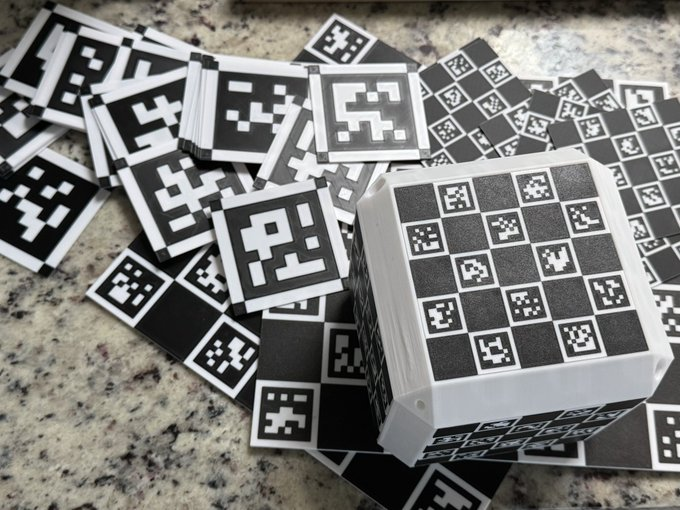

# Online 3D Marker Pattern Generator

**Live Page:** [https://lyehe.github.io/aruco_3d/](https://lyehe.github.io/aruco_3d/)

## Description
A comprehensive web-based tool to generate 3D printable patterns and 2D vector graphics for ArUco markers, QR codes, ChArUco boards, and marker arrays. These calibration targets are commonly used in computer vision, robotics, and augmented reality applications. The generator provides extensive customization options, multiple export formats, and shareable configurations. The designs support both single-color and multi-color 3D printing workflows.

## Features

### Pattern Types
*   **Single ArUco/AprilTag markers** - Individual markers with customizable borders
*   **Array markers** - Multi-marker grids with configurable spacing and gap filling
*   **ChArUco boards** - Checkerboard calibration targets with embedded ArUco markers
*   **QR codes** - Custom QR codes with configurable error correction and content
*   **Special markers** - Pure white (-1) and pure black (-2) markers for testing

### Marker Dictionaries
*   Original ArUco dictionary
*   ArUco 4×4, 5×5, 6×6, 7×7 families (50, 100, 250, 1000 markers)
*   AprilTag families: 16h5, 25h9, 36h10, 36h11
*   MIP_36h12 dictionary

### Customizable Parameters
*   **Marker ID(s)** - Individual IDs or comma-separated lists
*   **Dimensions** - Marker size, border width, gaps (in millimeters)
*   **3D Extrusion** - Base height and feature height for 3D printing
*   **Extrusion Types** - Positive, Negative, or Flat profiles
*   **Border Configuration** - Width and corner color options
*   **Array Layout** - Grid dimensions (X×Y) with gap filling options
*   **ChArUco Setup** - Checkerboard size, square dimensions, marker margins
*   **QR Code Content** - Custom text, URLs, or data with error correction levels

### Export Formats
*   **3D Models:**
    *   STL files (separate white/black parts for multi-color printing)
    *   Colored GLB files (single file with materials)
*   **2D Graphics:**
    *   High-resolution PNG (600 DPI) - perfect for paper printing
    *   Scalable SVG vectors - ideal for laser cutting and plotting
*   **Metadata** - JSON files with marker specifications and parameters

### Configuration Management
*   **YAML Export/Import** - Full configuration files for project management
*   **URL Sharing** - Share exact configurations via shareable links
*   **Compressed Configs** - Human-readable single-line configuration strings
*   **Copy/Paste Configs** - Quick configuration sharing via clipboard

### Interface Features
*   **Interactive 3D Preview** - Real-time visualization using Three.js
*   **Responsive Design** - Works on desktop, tablet, and mobile devices
*   **Mobile-Friendly** - Touch-optimized controls with collapsible navigation
*   **Instant Updates** - Real-time preview updates as you adjust parameters

## Example Prints


## Quick Start Examples

### URL Configuration Sharing
Share specific configurations by adding parameters to the URL:
```
https://lyehe.github.io/aruco_3d/?config=single:dict=4x4_1000,id=123,size=50,border=5,base=2,height=1,ext=positive
```

### Human-Readable Config Strings
- **Single Marker:** `single:dict=5x5_1000,id=42,size=75,border=10,ext=negative`
- **QR Code:** `qr:content=Hello%20World,size=100,border=15,error=H,ext=flat`
- **Array:** `array:dict=4x4_1000,grid=3x2,gap=5,size=40,ids=10+11+12+13+14+15`
- **ChArUco:** `charuco:dict=6x6_1000,board=8x6,square=60,margin=5,ext=positive`

### Common Workflows
1. **3D Printing:** Configure marker → Export STL files → Print white and black parts separately
2. **Laser Cutting:** Configure pattern → Export SVG → Cut from acrylic or wood
3. **Paper Printing:** Configure marker → Export PNG (600 DPI) → Print on high-quality paper
4. **Team Collaboration:** Configure → Copy share URL → Team members open same configuration

## 3D Printing Instructions and Tips
1.  Use black and white filaments. PLA or PLA+ is recommended for the best stiffness. The quality of the print is dependent on the quality of the filament and 3D printer.
2.  Flow rate should be calibrated (2-stage recommended) for the best top surface quality.
3.  Set the thickness to the multiples of the layer height.
4.  For single-colored printers, print the base layer, change the filament, and print the feature layer.
5.  For multi-colored printers, consider adding a backing to differentiate the base and feature layers. (export a blank base from the positive/negative options)
6.  The corner radius is limited by your printer's nozzle diameter, so the edges will not be as sharp as tags printed using a regular printer or UV printer. In practice, it is not a problem with sufficently large tags. 0.2 mm nozzle can handle ~20x20 mm tag size (2x2 mm small squares). 0.4 mm nozzle handles ~40x40 mm tag size (4x4 mm small squares).
7.  Make sure the tag is printed with with 1 mm thickness to prevent warping. For large tags and boards, increase the thickness. For 300x300 mm boards, >5 mm thickness is recommended.
8.  Before detaching the tag from the base, make sure the tag is fully cooled down to avoid warping.
9.  For the smoothest tags, print the tags facing down to a smooth build plate.
10. The tags can be add to other 3D models before slicing. You could also print the tags and stick to other 3D models afterwards.

## Export Format Guide

### 3D Models (STL/GLB)
- **White STL:** Contains only white/light-colored parts for 3D printing
- **Black STL:** Contains only black/dark-colored parts for 3D printing  
- **Colored GLB:** Combined model with materials for visualization and single-file workflows

### 2D Graphics (PNG/SVG)
- **PNG (600 DPI):** High-resolution raster image perfect for paper printing
  - Suitable for: Office printers, photo printing, documentation
  - Crisp quality up to large poster sizes
- **SVG Vector:** Scalable vector graphics with precise dimensions
  - Suitable for: Laser cutting, CNC routing, vinyl cutting, professional printing
  - Infinite scalability without quality loss
  - Includes real-world measurements in millimeters

### Configuration Files
- **YAML Config:** Human-readable full configuration with metadata
- **Compressed Config:** Single-line format for easy sharing and URL embedding
- **JSON Metadata:** Technical specifications and parameters for documentation

## New Features in Latest Version

### QR Code Generation
- Generate custom QR codes with any text, URL, or data
- Configurable error correction levels (L/M/Q/H)
- 3D printable with same quality as ArUco markers
- Perfect for embedding links, contact info, or instructions

### Advanced Configuration Sharing
- **URL Parameters:** Share exact configurations via web links
- **Human-Readable Strings:** Easy-to-understand configuration format
- **Copy/Paste Workflow:** Quick configuration sharing between team members
- **YAML Import/Export:** Professional project file management

### Enhanced Export Options
- **SVG Vector Export:** Professional-grade scalable graphics for manufacturing
- **High-DPI PNG:** 600 DPI raster images for high-quality printing
- **Optimized Rendering:** Eliminated hairline artifacts in vector outputs


## Acknowledgments
Marker dictionaries used in this project are sourced from the `arucogen` project by okalachev, available at [https://github.com/okalachev/arucogen](https://github.com/okalachev/arucogen). 

## License
Copyright (c) [2025] [Yehe Liu]

This work is licensed under a Creative Commons Attribution-NonCommercial-NoDerivatives 4.0 International License.
To view a copy of this license, visit [https://creativecommons.org/licenses/by-nc-nd/4.0/](https://creativecommons.org/licenses/by-nc-nd/4.0/)

--- 